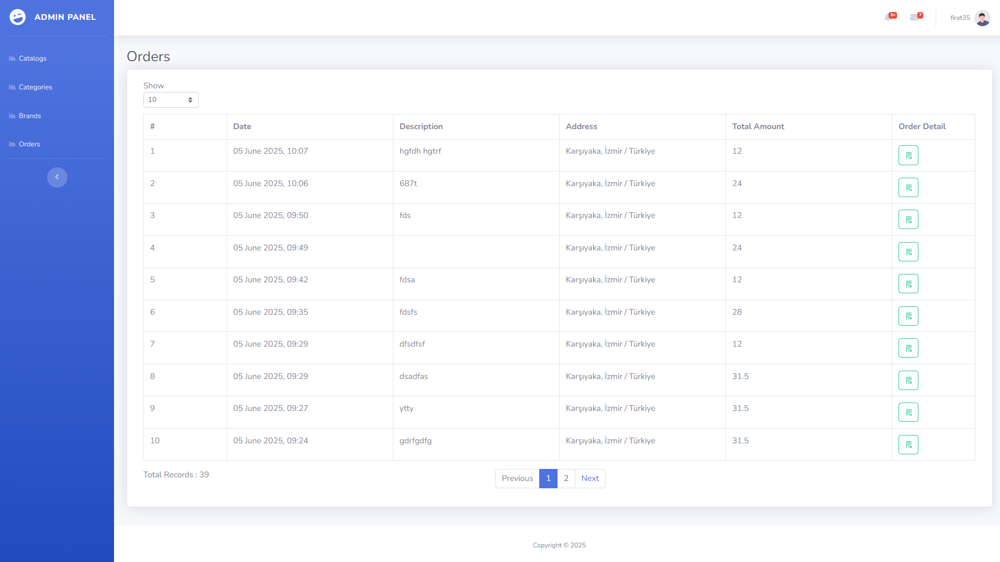
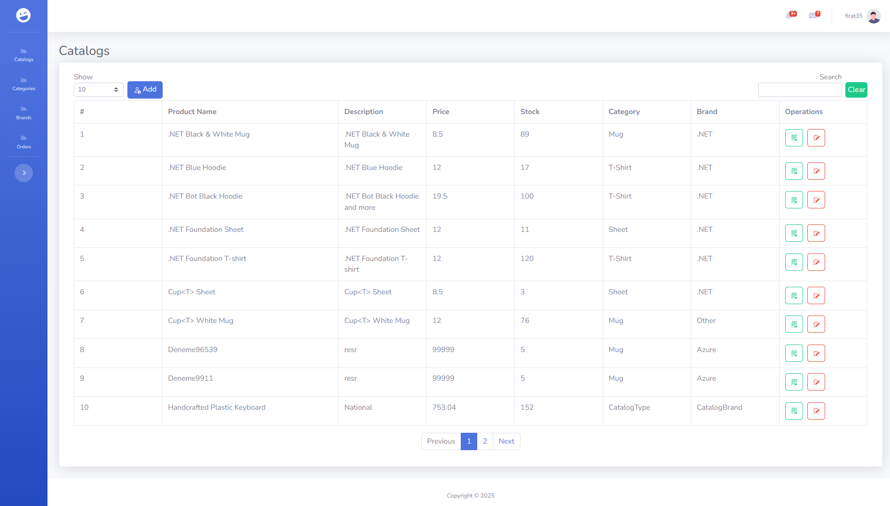
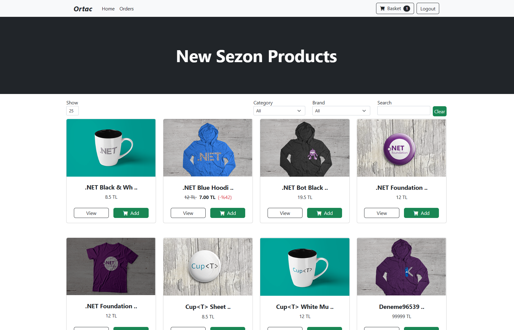
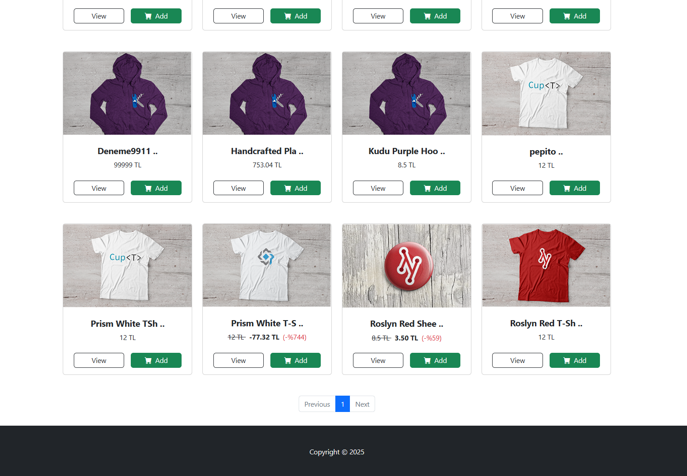
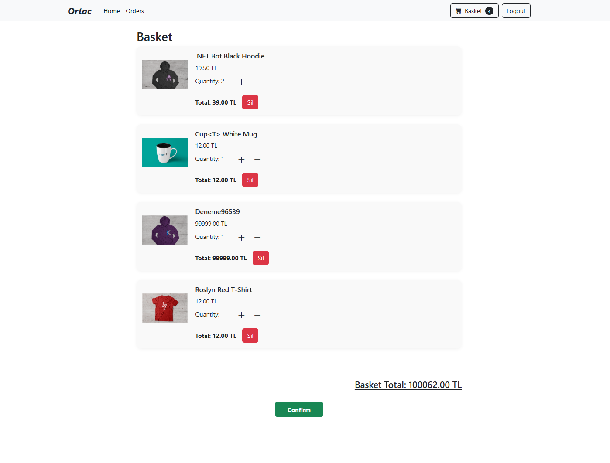
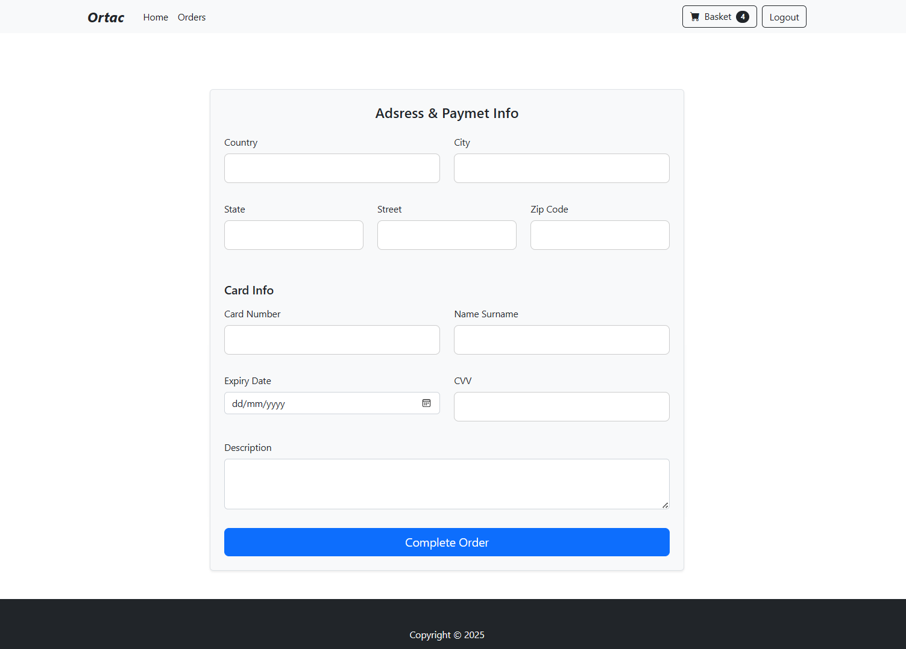
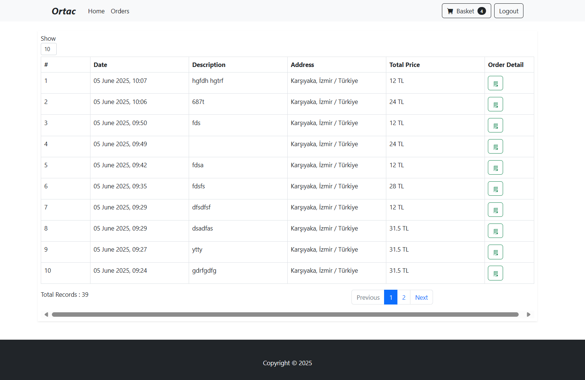
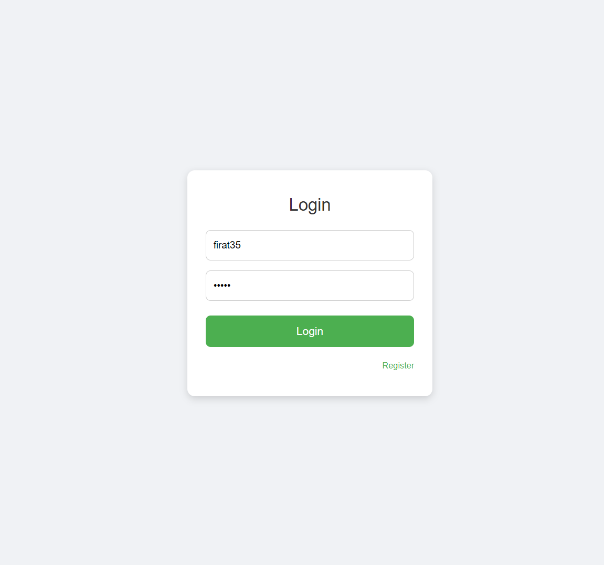
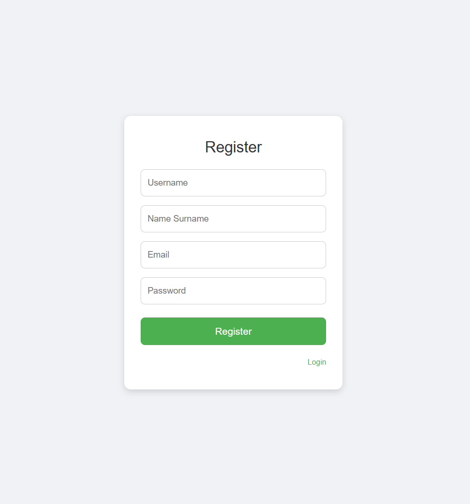

# 🧩 Microservice-Based Web Application

This project is a full-stack web application built using a **Microservice Architecture**, leveraging **.NET Web API** on the backend and **Vue.js** on the frontend. It incorporates modern development practices including API gateway aggregation, containerization, distributed caching, and service discovery for scalable and modular system design.

---

## 🛠️ Tech Stack

### 🔹 Backend (Microservices)
- **.NET 6+ Web API**
- **C#**
- **SQL Server** – Relational database
- **Redis** – Distributed caching
- **Ocelot API Gateway** – Routing and request aggregation
- **Consul** – Service discovery
- **Docker** – Containerization of services
- **Fake SMTP Server** – Email simulation/testing

### 🔹 Frontend
- **Vue.js 3**
- **TypeScript**
- **Axios** – API communication
- **Bootstrap** – UI styling

---

## 🎛️ Admin Panel

  
    
  

---

## 👥 User Panel

  
    
  
    
  
    
  
    
  
    
  
    
  

